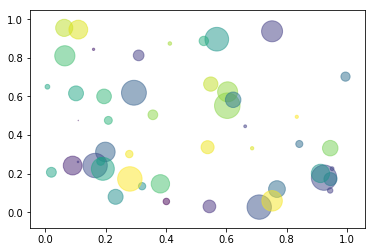

Link: https://notebooks.azure.com/CharlBest/libraries/learn/html/test.ipynb

# Sampel markdown 

* Note:


```python
print('hallo world')
```


```python
!pip list
```


```python
%matplotlib inline
```


```python
"""
Smpale demo of a scatter plot
"""

import numpy as np
import matplotlib.pyplot as plt

N = 50
x = np.random.rand(N)
y = np.random.rand(N)
colors = np.random.rand(N)
area = np.pi * (15 * np.random.rand(N)) ** 2 # 0 to 15 point radiuses

plt.scatter(x, y, s=area, c=colors, alpha=0.5)
plt.show()

```





```python
%%HTML
<iframe width="560" height="315" src="https://www.youtube.com/embed/HW29067qVWk" frameborder="0" allowfullscreen></iframe>
```


&lt;iframe allowfullscreen="" frameborder="0" height="315" src="https://www.youtube.com/embed/HW29067qVWk" width="560"&gt;&lt;/iframe&gt;


```python
import pandas as pd
import numpy as np

df = pd.DataFrame(np.random.randn(10, 5))
df.head()
```


<div>
<style>
    .dataframe thead tr:only-child th {
        text-align: right;
    }

    .dataframe thead th {
        text-align: left;
    }

    .dataframe tbody tr th {
        vertical-align: top;
    }
</style>
<table class="dataframe">
  <thead>
    <tr style="text-align: right;">
      <th></th>
      <th>0</th>
      <th>1</th>
      <th>2</th>
      <th>3</th>
      <th>4</th>
    </tr>
  </thead>
  <tbody>
    <tr>
      <th>0</th>
      <td>0.975105</td>
      <td>1.105013</td>
      <td>-0.884079</td>
      <td>-0.173938</td>
      <td>0.148588</td>
    </tr>
    <tr>
      <th>1</th>
      <td>0.635347</td>
      <td>-0.423587</td>
      <td>-0.569282</td>
      <td>-0.197817</td>
      <td>0.467989</td>
    </tr>
    <tr>
      <th>2</th>
      <td>0.367091</td>
      <td>1.205315</td>
      <td>-1.273537</td>
      <td>-1.260279</td>
      <td>-1.363506</td>
    </tr>
    <tr>
      <th>3</th>
      <td>1.825726</td>
      <td>0.042682</td>
      <td>-0.876381</td>
      <td>-2.173849</td>
      <td>-0.286444</td>
    </tr>
    <tr>
      <th>4</th>
      <td>0.067336</td>
      <td>0.357425</td>
      <td>-0.651804</td>
      <td>-0.675840</td>
      <td>-1.099555</td>
    </tr>
  </tbody>
</table>
</div>


```python
from sklearn import tree

# [height, weight, shoe size]
X = [
    [181, 80, 44],
    [177, 70, 43],
    [160, 60, 38],
    [154, 54, 37],
    [166, 65, 40],
    [190, 90, 47],
    [175, 64, 39],
    [177, 70, 40],
    [159, 55, 37],
    [171, 75, 42],
    [181, 85, 43],
]

Y = ['male', 'female', 'female', 'female', 'male', 'male', 'male', 'female', 'male', 'female', 'male']

# classifier
clf = tree.DecisionTreeClassifier()

clf = clf.fit(X,Y)

prediction = clf.predict([[190,70,43]])

print(prediction)
```

    ['male']

